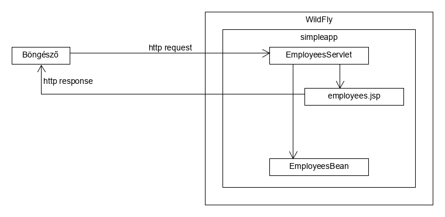
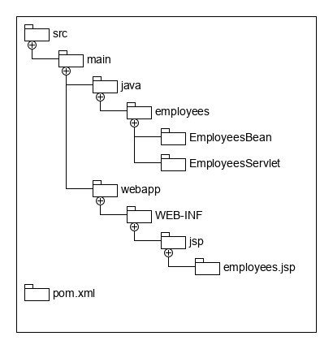
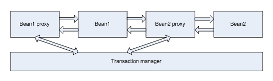

class: inverse, center, middle

# Enterprise alkalmazásfejlesztés Java EE környezetben

---

class: inverse, center, middle

## A Jakarta EE szabvány

---

## Jakarta EE

* Specifikációgyűjtemény nagyvállalati alkalmazásfejlesztésre
  * Ún. esernyő szabvány
  * Java Community Process
* Nagyvállalati alkalmazás: Java SE által nem támogatott tulajdonságok
* Implementációi: különböző alkalmazásszerverek
* https://jakarta.ee/

---

class: split-50

## Nagyvállalati alkalmazás

<div>
.column[
* Perzisztencia
* Többszálúság
* Tranzakció-kezelés
* Távoli elérés
* Névszolgáltatás
]
.column[
* Skálázhatóság
* Magas rendelkezésre állás
* Aszinkron üzenetkezelés
* Biztonság
* Monitorozás és beavatkozás
]
</div>

---

## Java EE története

* Sun azonosította, hogy újra és újra felmerülő követelményekre szabványos válasz legyen
  * Java 2 Platform, Enterprise Edition (J2EE) 1.2 (1999-ben)
* Oracle
* 2017\. szeptemberében átkerült az Eclipse alapítványhoz
* 2018-ban átnevezve Jakarta EE-re

---

## Java EE tulajdonságai

* POJO-kra épülő komponens modell, melyeket konténerként tartalmaz
  * Konténer vezérli az életciklusát
* Többrétegű alkalmazás architektúra
* Dependency Injection, Inversion of Control
* Aspektusorientált programozás támogatása
* Fejlesztők az üzleti problémák megoldására <br /> koncentráljanak
* Hordozhatóság az alkalmazásszerverek között

---

## Háromrétegű alkalmazás


---

## Alkalmazás felépítése

* Csomag (EAR, WAR)
  * Komponensek, pl. class fájlok
  * Telepítésleírók, deployment descriptorok
  * Erőforrás állományok, pl. képek, statikus tartalmak
* Modulokba szervezhető (belső JAR, WAR, stb. állományok)
* Alkalmazásszerverre telepítés: deploy folyamat

---

## EJB bean

```java
@Stateless
public class HelloBean {

    public String sayHello(String name) {
        return String.format("Hello %s!", name);
    }
}
```

---

## Servlet

```java
@WebServlet(urlPatterns = "/hello")
public class HelloServlet extends HttpServlet {

    @Inject
    private HelloBean helloBean;

    @Override
    protected void doGet(HttpServletRequest req, HttpServletResponse resp)
            throws ServletException, IOException {
        try (PrintWriter w = resp.getWriter()) {
            String name = req.getParameter("name");
            String message = helloBean.sayHello(name);
            w.println(message);
        }
    }
}
```

---

## Alkalmazásszerver

* Specifikációkat implementálja
* Tartalmazza az EJB konténert
* Alkalmazásszerverek
  * WildFly - nyílt forráskódú, JBoss Enterprise Application Platform (EAP) - fizetős
  * Payara Server Community - nyílt forráskódú, Payara Server Enterprise - fizetős
  * Eclipse GlassFish - nyílt forráskódú, Oracle GlassFish Server - fizetős
  * Oracle WebLogic Server - fizetős
  * Open Liberty - nyílt forráskódú, WebSphere Liberty, IBM WebSphere Application Server Libery, IBM WebSphere Application Server - fizetős

---

## Specifikációk - Közös és üzleti komponensek

* Contexts and Dependency Injection for the Java EE Platform (CDI) - DI
* Bean Validation - validáció, ellenőrzés a beaneknél
* Jakarta Enterprise Beans (EJB) - üzleti komponensek és folyamatok implementálására
* Jakarta Transaction API (JTA) - (elosztott) tranzakciókezelés
* Jakarta Concurrency - párhuzamosság
* Jakarta Batch - jobok ütemezésére és futtatására

---

## Specifikációk - Perzisztencia

* Jakarta Persistence API (JPA) - Java objektumok perzisztenciájára, ORM

---

## Specifikációk - Web réteg

* Jakarta Servlet - HTTP protokoll kezelésére, alapkomponense a Servlet
* Jakarta Server Pages (JSP) - dinamikus (főleg) HTML generálására, template engine, alapkomponense a JSP oldal
* Jakarta Expression Language (EL) - apró nyelv, JSP és JSF oldalakban kifejezések megadására
* Jakarta Standard Tag Library (JSTL) - JSP-n belüli vezérlésekre, pl. feltételek, ciklusok, alapkomponense a tag
* Jakarta Faces (JSF) - komponens alapú webes UI előállítására
* Java API for WebSocket - WebSocket (full-duplex kommunikáció) kezelésére Javaból

---

## Specifikációk - Integráció és webszolgáltatások

JSON, REST:

* Jakarta JSON Processing (JSON-P) - JSON alacsony szintű kezelésére
* Jakarta JSON Binding (JSON-B) - Java objektumok és JSON dokumentumok közötti megfeleltetés
* Jakarta RESTful Web Services (JAX-RS)

XML, SOAP:

* Jakarta XML Binding (JAXB) - Java objektumok és XML dokumentumok közötti megfeleltetés
* Jakarta XML Web Services (JAX-WS) - SOAP webszolgáltatások

Egyéb:

* Jakarta Messaging API (JMS) - aszinkron üzenetküldés <br /> üzenetsorokon keresztül
* Jakarta Mail - email küldés
  * Jakarta Activation Framework (JAF) - MIME types kezelésére
* Jakarta Connectors

## Security

* Jakarta Authorization
* Jakarta Authentication

---

class: inverse, center, middle

## Contexts and Dependency Injection for the Java EE Platform

---

## Inversion of Control

* A program részei egy újrafelhasználható keretrendszertől kapják meg a vezérlést
* Komponensek és konténer
* Növeli a modularitást és a kiterjeszthetőséget
* Robert C. Martin és Martin Fowler terjesztette el
* "Don't call us we will call you"

---

## Dependency Injection

* Tervezési minta (nem GoF)
* Inversion of Control egy implementációja a függőségekkel kapcsolatban
* Az objektumok nem maguk példányosítják vagy kérik le a függőségeiket
* Csak leírják, mire van szükségük
* A komponenseket a konténer példányosítja és köti össze
* Egy központosított vezérlés a komponensek <br /> életciklusa és kapcsolatai fölött

---

## Dependency Injection előnyei

* Low coupling (laza kapcsolat)
* Implementációk cserélhetősége
* Tesztelés segítése (test double objektumok használata: pl. dummy, stub, mock)
* Újrafelhasználhatóság növelése, boilerplate kód csökkentése

---

## CDI

* CDI konténer
* Jól definiált bean életciklus
* Dependency injection
* Scope: request, session, application, conversation
* AOP támogatás, interceptor
* Eseménykezelés
* Beépül más szabványokba
* Java SE-n belül is használható

---

class: inverse, center, middle

## CDI tesztelése

---

## Függőségek

```xml
<dependency>
    <groupId>org.junit.jupiter</groupId>
    <artifactId>junit-jupiter-engine</artifactId>
    <version>5.10.0</version>
    <scope>test</scope>
</dependency>


<dependency>
    <groupId>org.mockito</groupId>
    <artifactId>mockito-junit-jupiter</artifactId>
    <version>5.13.0</version>
    <scope>test</scope>
</dependency>
```

---

## Unit teszt

```java
class EmployeeServiceTest {

    EmployeeDao employeeDao = Mockito.mock(EmployeeDao.class);

    EmployeeService employeeService = new EmployeeService(employeeDao);

    @Test
    void saveEmployee() {
        employeeService.saveEmployee("  John Doe  ");
        verify(employeeDao).saveEmployee("John Doe");
    }

}
```

---

## Unit teszt DI-nel

```java
@ExtendWith(MockitoExtension.class)
class EmployeeServiceInjectTest {
    @Mock
    EmployeeDao employeeDao;

    @InjectMocks
    EmployeeService employeeService;

    @Test
    void saveEmployee() {
        employeeService.saveEmployee("  John Doe  ");
        verify(employeeDao).saveEmployee("John Doe");
    }

}
```

---

class: inverse, center, middle

## Egyszerű Java EE alkalmazás REST API-val

---

## Egyszerű alkalmazás

* https://start.jakarta.ee/
* Jakarta EE 10, Platform, Java SE 17, WildFly, Docker support Yes

```shell
mvn wildfly:dev
```

---

class: inverse, center, middle

## Egyszerű Java EE alkalmazás

---

## Egyszerű alkalmazás felépítése EJB beannel és servlettel

* Model 2



---

## Projekt



---

## Függőségek

```xml
<dependencies>
  <dependency>
      <groupId>jakarta.platform</groupId>
      <artifactId>jakarta.jakartaee-api</artifactId>
      <version>10.0.0</version>
      <scope>provided</scope>
  </dependency>
</dependencies>
```

---

## Maven pluginek

```xml
<build>
    <finalName>simpleapp</finalName>
    <plugins>
        <plugin>
            <groupId>org.apache.maven.plugins</groupId>
            <artifactId>maven-war-plugin</artifactId>
            <version>3.4.0</version>
        </plugin>
        <plugin>
            <groupId>org.wildfly.plugins</groupId>
            <artifactId>wildfly-maven-plugin</artifactId>
            <version>4.2.0.Final</version>
        </plugin>
    </plugins>
</build>
```

---

## WildFly alkalmazásszerver

* Red Hat/JBoss
* Nyílt forráskódú
* Letölthető a [http://www.wildfly.org/](http://www.wildfly.org/) címről
* Kicsomagolható, és a `bin\standalone.bat` állománnyal indítható

---

## Deploy

* `mvn wildfly:deploy` paranccsal telepíthető a lokálisan indított alkalmazásszerverre
* Elérhető böngészőből a `http://localhost:8080/employees` címen

---
class: inverse, center, middle

## Java EE alkalmazás tesztelése

---

## Tesztelési módszerek

* Unit tesztelés - osztályok önmagukban, alkalmazásszerver nélkül
* Integrációs tesztelés, pl. Arquillian
* E2E tesztelés
  * UI tesztelés, pl. Selenium
  * API tesztelés, pl. RestAssured

---

## Unit tesztelés

* EJB beanek, servletek alkalmazásszerver szolgáltatásokat használnak
* Ezen szolgáltatások mockolása bonyolult
* Válasszuk le a logikát külön osztályba, melyek nem függenek a Java EE szabványoktól

---

class: inverse, center, middle

## Adatbázis hozzáférés

---

## Részei

* Adatbázis elindítása
* Adatbázis séma
* JDBC driver
* DataSource
* DAO

---

## Adatbázis indítása

```shell
docker run -d -e POSTGRES_DB=employees -e POSTGRES_USER=employees  -e POSTGRES_PASSWORD=employees  -p 5432:5432  --name employees-postgres postgres
```

---

## Adatbázis séma

Postgres:

```sql
create sequence employee_seq increment by 50;
create table employee (id bigint, emp_name varchar(255), primary key (id));
```

---

## Relációs adatbázishoz való hozzáférés

* JDBC Driver implementálja a JDBC API-t
* JDBC Driver az alkalmazásszerver része legyen, ne az alkalmazásé
* MariaDB-hez letölthető: https://mariadb.com/downloads/#connectors

---

## JDBC url

* Adatbázis szerver elérésének megadására, Java specifikus
* `jdbc:[gyártó]:[adatbázis specifikus elérési út]`  
* `jdbc:mysql://localhost:3306/employees?useUnicode=true`
* `jdbc:oracle:thin:@localhost:1521:employees`
* `jdbc:sqlserver://localhost\employees`
* `jdbc:h2:mem:db;DB_CLOSE_DELAY=-1`

---

## DataSource

* Connection factory
* Connection pool
* Alkalmazásszerveren belül konfigurálható

---

## DataSource beállítása WildFly-on

Driver letöltése: https://repo.maven.apache.org/maven2/org/postgresql/postgresql/42.7.4/postgresql-42.7.4.jar

A `bin\jboss-cli.bat --connect` paranccsal elindítva a parancssorba beírandó:

Postgres:

```shell
deploy "postgresql-42.7.4.jar"
data-source add --name=EmployeeDS --jndi-name=java:/jdbc/EmployeeDS \
  --driver-name=postgresql-42.7.4.jar \
  --connection-url=jdbc:postgresql://localhost:5432/employees \
  --user-name=employees \
  --password=employees
/subsystem=datasources:read-resource
```

---

## DAO

* Műveletek DAO-ban (Data Access Object - Java EE tervezési minta)
* DataSource hozzáférés DI-vel

---

## DAO példa

```java
@Stateless
public class EmployeesDao {

    @Resource(mappedName = "java:/jdbc/EmployeeDS")
    private DataSource dataSource;

    public List<Employee> listEmployees() {
        // ...
    }

    public void createEmployee(Employee employee) {
        // ...
    }

}
```

---

## JDBC lekérdezés

```java
public List<Employee> listEmployees() {
    try (Connection conn = dataSource.getConnection();
         PreparedStatement ps = conn.prepareStatement("select id, emp_name from employees");
         ResultSet rs = ps.executeQuery()
    ) {
        List<Employee> employees = new ArrayList<>();
        while (rs.next()) {
            long id = rs.getLong("id");
            String name = rs.getString("emp_name");
            employees.add(new Employee(id, name));
        }
        return employees;
    }
    catch (SQLException ioe) {
        throw new IllegalStateException("Can not query employees"
            , ioe);
    }
}
```

---

## JDBC beszúrás

```java
public void createEmployee(Employee employee) {
    try (Connection conn = dataSource.getConnection();
         PreparedStatement ps = conn.prepareStatement("insert into employees(emp_name) values (?)");
    ) {
        ps.setString(1, employee.getName());
        ps.executeUpdate();
    }
    catch (SQLException ioe) {
        throw new IllegalStateException("Cannot insert employee", ioe);
    }
}
```
---

class: inverse, center, middle


## JPA

---

## JPA

* JDBC bonyolultsága: leképzés a relációs adatbázis és oo világ között
* Megoldás: keretrendszer biztosítsa konfiguráció alapján
* ORM: Object-Relational Mapping
* Szabvány: JPA
* Implementációi: Hibernate, EclipseLink, OpenJPA
* JDBC-re épül

---

## Entitások

```java
@Entity
public class Employee {

    @Id
    private Long id;

    private String name;

    public Employee() {
    }

    // Getter és setter metódusok
}
```

```sql
create table employee (id bigint,
  name varchar(255),
    constraint pk_employees primary key (id));
```

---

## Személyre szabás

```java
@Entity
@Table(name = "employees")
public class Employee {

    @Id
    private Long id;

    @Column(name = "emp_name")
    private String name;

    // Getter és setter metódusok
}
```

```sql
create table employees (id bigint,
  emp_name varchar(255),
    constraint pk_employees primary key (id));
```

---

## Azonosítógenerálás

```java
@Id
@GeneratedValue(strategy = GenerationType.IDENTITY)
private Long id;
```

```sql
create table employees (id bigint auto_increment,
  emp_name varchar(255),
    constraint pk_employees primary key (id));
```


---

## EntityManager

* CRUD műveletek

```java
Employee employee = new Employee();
employee.setName("John Doe");
entityManager.persist(employee);
```

```java
Employee employee = entityManager.find(Employee.class, 1);
employee.setName('Jack Doe');
```

```java
Employee employee = entityManager.find(Employee.class, 1);
entityManager.remove(employee);
```

```java
entityManager
  .createQuery("select e from Employee e order by e.name",
      Employee.class)
    .getResultList();
```

---

## EntityManager hozzáférés

* `EntityManagerFactory` (persistence context) előre konfigurálása `persistence.xml` alapján
* `EntityManager` injektálás `@PersistenceContext` annotációval

---

## Persistence unit

```xml
<?xml version="1.0" encoding="UTF-8"?>
<persistence version="2.1" xmlns="http://xmlns.jcp.org/xml/ns/persistence"
  xmlns:xsi="http://www.w3.org/2001/XMLSchema-instance"
  xsi:schemaLocation="http://xmlns.jcp.org/xml/ns/persistence
    http://xmlns.jcp.org/xml/ns/persistence/persistence_2_1.xsd">
  <persistence-unit name="pu" transaction-type="JTA">
      <jta-data-source>jdbc/EmployeeDS</jta-data-source>
    <exclude-unlisted-classes>false</exclude-unlisted-classes>
    <properties>
            <property name="javax.persistence.schema-generation.database.action"
                value="drop-and-create"/>
            <property name="hibernate.show_sql" value="true"/>
    </properties>
  </persistence-unit>
</persistence>
```

---

## DAO

```java
@Stateless
public class EmployeesDao {

    @PersistenceContext
    private EntityManager entityManager;

    @Transactional
    public void createEmployee(Employee employee) {
        entityManager.persist(employee);
    }

    public List<Employee> listEmployees() {
        return entityManager
            .createQuery("select e from Employee e", Employee.class)
                 .getResultList();
    }
}
```

---

class: inverse, center, middle


# Tranzakciókezelés

---

## Tranzakciókezelés

* ACID tulajdonságok
  * Atomicity
  * Consistency
  * Isolation
  * Durability

---

## Két fajta megközelítés

* Programozott tranzakciókezelés
* Deklaratív tranzakciókezelés

---

## Programozott tranzakciókezelés

```java
@Stateless
@TransactionManagement(TransactionManagementType.BEAN)
public class EmployeesDao {

    @PersistenceContext
    private EntityManager entityManager;

    @Resource
    private UserTransaction ut;

    public void createEmployee(Employee employee) {
      try {
        ut.begin();
        entityManager.persist(employee);
        ut.commit();
      }
      catch (Exception e) {
        ut.rollback();
      }
    }

}
```

---

## Deklaratív tranzakciókezelés

```java
@Stateless
public class EmployeesDao {

    @PersistenceContext
    private EntityManager entityManager;

    @Transactional
    public void createEmployee(Employee employee) {
        entityManager.persist(employee);
    }

}
```


---

## Propagáció

* `@TransactionAttribute` annotációval
* `TransactionAttributeType` enum



---

## Propagációs tulajdonságok

* `REQUIRED` (default): ha nincs tranzakció, indít egyet, ha van csatlakozik hozzá
* `REQUIRES_NEW`: mindenképp új tranzakciót indít
* `SUPPORTS`: ha van tranzakció, abban fut, ha nincs, nem indít újat
* `MANDATORY`: ha van tranzakció, abban fut, ha nincs, kivételt dob
* `NOT_SUPPORTED`: ha van tranzakció, a tranzakciót felfüggeszti, ha nincs, nem indít újat
* `NEVER`: ha van tranzakció, kivételt dob, ha nincs, <br /> nem indít újat

---

## Izoláció

* Java EE nem támogatja a tranzakciónkénti izolácós szint állítását
* Izolációs problémák:
    * dirty read
    * non-repetable read
    * phantom read
* Izolációs szintek:
    * read uncommitted
    * read commited
    * repeatable read
    * serializable

---

## Visszagörgetési szabályok

* Konténer dönt a commitról vagy rollbackről
* Kivételek esetén:
  * Checked kivétel: commit  
  * Unchecked kivétel: rollback
  * Felülbírálható: `@ApplicationException(rollback = true)`
  * Felülbírálható:

```java
@Transactional(rollbackOn = SQLException.class,
    dontRollbackOn = {ArrayIndexOutOfBoundsException.class,
        IllegalArgumentException.class})
```

---

## Rollbackre explicit módon megjelölni

* `SessionContext` injektálás
* `setRollbackOnly()` és `getRollbackOnly()` metódusok

---

## Visszagörgetésre megjelölés

```java
@Stateless
public class EmployeesDao {

    @PersistenceContext
    private EntityManager entityManager;

    @Resource
    private SessionContext ctx;

    @Transactional
    public void createEmployee(Employee employee) {
        entityManager.persist(employee);

        if (employee.getName().equals("")) {
            ctx.setRollbackOnly();
        }
    }

}
```

---

class: inverse, center, middle


## Enterprise JavaBeans

---

## EJB

* Szerveroldali Java komponens, melyet a konténer tartalmaz
* Üzleti logika (best practice: üzleti logika kiszervezése POJO-kba)
* POJO, annotációkkal
* Életciklusát (példányosítás) a konténer vezérli
* Hozzáfér konténer szolgáltatásokhoz - ennyivel több a CDI Beaneknél

---

## EJB típusok

* Stateless session bean
* Stateful session bean
* Singleton session bean
* Message driven bean

---
class: split-50

## Konténer szolgáltatások

<div>
.column[
* Távoli elérés
* Dependency injection: más beanek és külső erőforrások
  * Adatbázis, JMS sor, mail server
* Pool (stateless session bean, MDB)
* Életciklus kezelés, példányosítás
* Tranzakciókezelés
* Biztonság
* AOP
]
.column[
* Párhuzamosság
* Aszinkron hívás
* Ütemezés
* Magas rendelkezésreállás és skálázhatóság
]
</div>

---

## Távoli elérés

* Implementálhatnak üzleti interfészeket
* Interfészek lehetnek helyi (local) vagy távoli (remote) interfészek
* Lokális interfészben definiált metódusok elérhetőek az adott JVM-ből
* Távoli interfészben definiált metódusok elérhetőek más JVM-ből
* `@Local` és `@Remote` annotációk

---

## JNDI

* Java Naming and Directory Interface
* Névszolgáltatás
* Egységes JNDI nevekkel kerülnek az EJB-k bejegyzésre

```
java:<scope>[/<app-name>]/<module-name>/<bean-name>[!<fully-qualified-interface-name>]
```

---

## JNDI nevek

```
14:02:41,176 INFO  [org.jboss.as.ejb3.deployment] (MSC service thread 1-1) WFLYEJB0473:
JNDI bindings for session bean named 'EmployeesDao'
in deployment unit 'deployment "empapp.war"' are as follows:

java:global/empapp/EmployeesDao!employees.EmployeesDao
java:app/empapp/EmployeesDao!employees.EmployeesDao
java:module/EmployeesDao!employees.EmployeesDao
ejb:empapp/EmployeesDao!employees.EmployeesDao
java:global/empapp/EmployeesDao
java:app/empapp/EmployeesDao
java:module/EmployeesDao
```

---

## Stateless session bean

* Állapotmentes
* "Rövid élettartamú, egy metódus hívásig él" - lsd. pooling
* Egy kérés-válasz erejéig
* `@Stateless` annotáció


---
class: inverse, center, middle


## Singleton session bean

---

## Singleton session bean

* JVM-enként egy példány
* Használható inicializálásra
  * Induljon el az alkalmazással együtt: `@Startup` annotációval
* Megadható sorrend
  * `@DependsOn` annotációval
* Használható állapot megosztásra
  * Pl. cache, attribútumként

---
class: inverse, center, middle


## Callback metódusok

---

## Callback metódusok

* Beanek életciklusához köthető eseményekkor
  * `@PostConstruct`
  * `@PrePassivate`
  * `@PostActivate`
  * `@PreDestroy`
* Metódus annotációval
  * Visszatérési érték `void`
  * Metódus neve szabadon választható
  * Paraméter nélkül
  * Csak nem ellenőrzött kivételt dobhat


---
class: inverse, center, middle


## Bean Validation

---

## Bean Validation

* Szabványos megoldás validációra
  * Ember vagy számítógép által a rendszerbe bevitt adatok ellenőrzésére
* Ne réteghez legyen kötve, hanem az adatot hordozó beanhez
* Megadható metódus paraméterekre és visszatérési értékre is

---

## Annotációk használata

```java
public class Employee {

  @NotBlank
  @Size(max = 200)
  private String name;

  @Min(100_000)
  private int salary;
}
```

---

## Beépített annotációk

* `@AssertFalse`, `@AssertTrue`
* `@Null`, `@NotNull`
* `@Size`
* `@Max`, `@Min`, `@Positive`, `@PositiveOrZero`, `@Negative`, `@NegativeOrZero`
* `@DecimalMax`, `@DecimalMin`
* `@Digits`

---

## Beépített annotációk

* `@Future`, `@Past`, `@PastOrPresent`, `@FutureOrPresent`
* `@Pattern`
* `@Email`
* `@NotEmpty`, `@NotBlank`

---

## Validáció futtatása

```java
ValidatorFactory validatorFactory = Validation.buildDefaultValidatorFactory();
Validator validator = validatorFactory.getValidator();
Set<ConstraintViolation<Employee>> violations = validator.validate(employee);
```

`ConstraintViolation` metódusai:

* `getPropertyPath()`
* `getInvalidValue()`
* `violation.getMessageTemplate()`

```
{javax.validation.constraints.NotBlank.message}
```

---

## Validáció CDI esetén

`Validator` példány injektálható

```java
@Named
public class EmployeeDao {

    @Inject
    private Validator validator;

    // ...
}
```

---

## Konstruktor, metódus paraméter és visszatérési érték

```java
private class EmployeeBean {

  @Positive
  public @Min(1) int createEmployee(@NotBlank @Size(max = 200) String name,
                                    @Min(100_000) int salary) {
    // ...
  }
}
```

* Háttérben `ExecutableValidator` példány, de ne használjuk közvetlenül, mindig
bízzuk valamilyen keretrendszerre, <br /> mint pl. a CDI

---
class: inverse, center, middle


## Saját validáció implementálása

---

## Validáció kompozíció

```java
@Target({METHOD, FIELD, ANNOTATION_TYPE, CONSTRUCTOR, PARAMETER})
@Retention(RUNTIME)
@Constraint(validatedBy = {})
@NotNull
@Pattern(regexp = "[0-9]*")
public @interface ZipCode {

    String message() default "{zipcode.invalid_format}";
    Class<?>[] groups() default {};
    Class<? extends Payload>[] payload() default {};
}
```

---

## Kötelező metódusok

* `message()` - hibaüzenet kulcsa
* `groups()` - csoportok, különböző helyzetekben más validációs szabályok
* `payload()` - metaadat, paraméterezhetőség

---

## Saját validáció - annotáció

```java
@Constraint(validatedBy = DivByValidator.class)
@Target({METHOD, FIELD, ANNOTATION_TYPE, CONSTRUCTOR, PARAMETER})
@Retention(RUNTIME)
public @interface DivBy {

    String message() default "{div_by.invalid_value}";
    Class<?>[] groups() default {};
    Class<? extends Payload>[] payload() default {};

    int number() default 10;
}
```

---

## Saját validáció - implementáló osztály

```java
public class DivByValidator implements ConstraintValidator<DivBy, Integer> {

    private int number;

    @Override
    public void initialize(DivBy constraintAnnotation) {
        number = constraintAnnotation.number();
    }

    @Override
    public boolean isValid(Integer value, ConstraintValidatorContext constraintValidatorContext) {
        return value.intValue() % number == 0;
    }
}
```

---

## Osztály szintű validáció

```java
@CountryAndZipValidation
public class Employee {

  private String country;

  private String zip;
}
```

* Pl. attribútumok összefüggésére

---

## Osztály szintű validáció - annotáció

```java
@Constraint(validatedBy = CountryAndZipValidator.class)
@Target({TYPE, METHOD, FIELD, ANNOTATION_TYPE, CONSTRUCTOR, PARAMETER})
@Retention(RUNTIME)
public @interface CountryAndZip {

    String message() default "{country_and_zip.illegal_zip_for_country}";
    Class<?>[] groups() default {};
    Class<? extends Payload>[] payload() default {};

}
```

---

##  Osztály szintű validáció - implementáló osztály

```java
public class CountryAndZipValidator implements ConstraintValidator<CountryAndZip, Employee> {

    @Override
    public boolean isValid(Employee value, ConstraintValidatorContext context) {
        return !value.getCountry().equals("HU") ||
                value.getZip().matches("[0-9]{4}");
    }
}
```

---
class: inverse, center, middle

## Naplózás
---

## Naplózás

* Rendszerben történő események, rendszer állapota
* Monitorozás, hibakeresés, audit
* Éles környezetben, ahol a debugger nem elérhető
* `System.out.println` helyett

---

## Naplózó keretrendszerek

* Apache Commons Logging API
* Log4j
* Log4j 2
* Logback
* `java.util.logging` - JUL
* SLF4J

---

## Jellemzők

* Különböző modulokhoz/komponensekhez különböző naplózási szintek
* Naplózási szintek (trace, debug, info, error)
* Forráskód módosítása nélkül, konfigurációs állományban beállítható
* Több cél (pl. fájl, adatbázis, stb.)
* Több formátum

---

## Java EE naplózás

* Java EE nem ad szabványos támogatást
* Egy alkalmazásszerveren több alkalmazás
* Adminisztrátor által módosítható legyen, alkalmazás módosítása nélkül
  * Vagy alkalmazásszerver függő, így standard adminisztrációs eszközökkel karbantartható legyen
  * Vagy alkalmazás kívülről olvasson be egy fájlt

---

## Javasolt megoldás

* SLF4J alkalmazása
* Alkalmazásszerver támogatás megvizsgálása

```xml
<dependency>
    <groupId>org.slf4j</groupId>
    <artifactId>slf4j-api</artifactId>
    <version>1.7.25</version>
</dependency>
```

```java
private final Logger logger =
	LoggerFactory.getLogger(this.getClass());
```

```java
logger.info("Employee has created with id {}", employee.getId());
```

---

## WildFly támogatás

* Globális konfiguráció: logging subsystem
* SLF4J függőség adott, `provided` scope
* Log4j implementáció
* Konzolra írást is átirányítja a Log4j-nek

---

## Platformfüggetlen megoldás

* Alkalmazásszerver konfigurálása, hogy ne avatkozzon bele
* SLF4J függőség
* Implementáció függőség, pl. Logback
* Annak implementálása, hogy kerüljön a fájlrendszerben tárolt külső
  konfigurációs állomány


---
class: inverse, center, middle

# RESTful webszolgáltatások JAX-RS szabvánnyal

---

## RESTful webszolgáltatások

* Roy Fielding: Architectural Styles and the Design of Network-based Software Architectures, 2000
* Representational state transfer
* Egyedileg címezhető erőforrások (resource)
* Erőforrások különböző formátumokban elérhetőek
* Erőforrásokon végzett standard (CRUD) műveletek
* Állapotmentes (stateless)

---

## RESTful webszolgáltatások

* Létező technológiák: URI, HTTP, XML, JSON
* AJAX világ segítette az elterjedését
* Web Application Description Language (WADL) – nem elterjedt

---

## HTTP újrafelhasználása

* URL
* HTTP metódusok használata (GET, PUT, POST, DELETE)
* Mime-type
* URL paraméterek
* Fejlécek
* Státuszkódok

---

## JAX-RS


* Java EE része, Java SE-ben is használható
* Root resource classes: POJO, EJB
* Resource methods: URI & operation to method mapping

---

## Deployment

```java
@ApplicationPath("api")
public class RestConfig extends Application
{
}
```

---

## JAX-RS annotációk

* `@Path`
* `@Produces`
* `@Consumes`
* `@GET`, `@POST`, `@PUT`, `@DELETE`, `@HEAD` és `@OPTIONS`, `@HttpMethod`
* `@PathParam`, `@QueryParam`, `@MatrixParam`,
`@CookieParam`, `@HeaderParam` és `@FormParam`

---

## Resource

```java
@Path("employees")
public class EmployeeResource {

  @Inject
  private EmployeeServiceBean employeeServiceBean;

  @GET
  @Produces(MediaType.APPLICATION_JSON)
  public List<Employee> listEmployees() {
      return employeeServiceBean.findEmployees();
  }

  @GET
  @Path("{id}")
  @Produces(MediaType.APPLICATION_JSON)
  public Employee findEmployeeById(@PathParam long id) {
      return employeeServiceBean.findEmployeeById(id);
  }

}
```

---

## Resource

```java
@Path("employees")
public class EmployeeResource {

  // ...

  @POST
  @Consumes(MediaType.APPLICATION_JSON)
  @Produces(MediaType.APPLICATION_JSON)
  public Response saveEmployee(Employee employeeData) {
      return Response
        .status(201)
        .entity(employeeServiceBean.saveEmployee(employeeData.getName()))
        .build();
  }

}
```

---

## Postman

* API fejlesztési életciklus támogatás
* RESTful webszolgáltatás hívások
* Egyszerre több környezet támogatása
* JavaScripttel szkriptelhető
* Automatikus tesztesetek
* Mock server
* Dokumentáció generálás
* Tesztesetek futtatása parancssorban

---
class: inverse, center, middle

# Java Message Service

---

## Message Oriented Middleware

* Rendszerek közötti üzenetküldés
* Megbízható üzenetküldés: store and forward
* Következő esetekben alkalmazható hatékonyan
  * Hívott fél megbízhatatlan
  * Kommunikációs csatorna megbízhatatlan
  * Hívott fél lassan válaszol
  * Terheléselosztás
  * Heterogén rendszerek
* Lazán kapcsolt rendszerek: nem kell ismerni a <br /> címzettet

---

## JMS

* Szabványos Java API MOM-ekhez való hozzáféréshez
* Java EE része, de Java SE-ben is használható
* JMS provider
  * IBM MQ, Apache ActiveMQ, RabbitMQ
* Hozzáférés JMS API-n keresztül

---

## Destination

* Az üzenet küldésének célja
* Az üzenet fogadásának forrása
* Point to point környezetben: sor (queue)
* Publish and subscribe környezetben: téma (topic)
* JNDI vagy dependency injection

---

## Üzenet küldése

```java
@Stateless
public class MessageSender {

  @Inject
  private JMSContext context;

  @Resource(mappedName = "java:/jms/queue/EmployeeQueue")
  private Queue queue;

  public void sendMessage(String name) {
    context.createProducer().send(queue, name);
  }  
}
```

---

## Message

* `javax.jms.TextMessage extends javax.jms.Message`
* További interfészek: `BytesMessages`, `MapMessage`, `ObjectMessage`, `StreamMessage`
* Factory metódusok: pl. `createTextMessage(String text)`, stb.

---

## Message Driven Bean

* EJB üzenetek fogadására
* Állapotmentes, a konténer hívja
* Esemény alapú (aszinkron) – üzenet beérkezés
* `@MessageDriven` annotation
* `MessageListener` interfész `onMessage` metódusa
* Tipikusan típuskényszerítés a megfelelő üzenet <br /> típusra, majd delegálás session beanhez

---

## Üzenetfogadás MDB-vel

```java
@MessageDriven(activationConfig = {
        @ActivationConfigProperty(
                propertyName = "destination",
                propertyValue = "java:/jms/queue/EmployeeQueue"
        )
})
public class EmployeesMessageDrivenBean implements MessageListener {

    @Override
    public void onMessage(Message message) {
        if (message instanceof TextMessage) {
            TextMessage textMessage = (TextMessage) message;
            try {
                System.out.println("Message has arrived: " + 
                    textMessage.getText());
            } catch (JMSException e) {
                e.printStackTrace();
            }
        }

    }
}
```

---

## WildFly támogatás

* `full` konfigurációval kell indítani, ekkor aktiválódik a JMS

```
$ standalone.bat -c=standalone-full.xml
```

* Adminisztrációs felületen (cli/webes) sor felvétele

```shell
$ bin\jboss-cli.bat --connect

/subsystem=messaging-activemq/server=default/jms-queue=\
  EmployeeQueue:add(entries=[java:/jms/queue/EmployeeQueue])

/subsystem=messaging-activemq/server=default/address-setting=\
  jms.queue.EmployeeQueue:add(redelivery-delay=1500, \
  redelivery-multiplier=1.5, \
  max-redelivery-delay=5000, max-delivery-attempts=-1)
```

